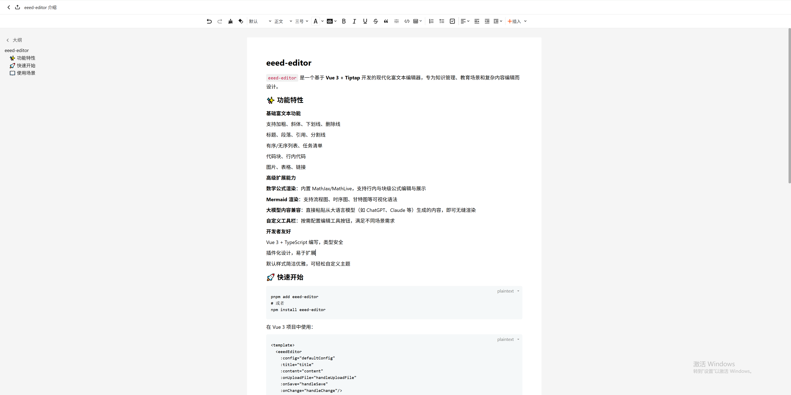

# eeed-editor

`eeed-editor` 是一个基于 **Vue 3 + Tiptap** 开发的现代化富文本编辑器，专为知识管理、教育场景和复杂内容编辑而设计。



## ✨ 功能特性

* **基础富文本功能**

  * 支持加粗、斜体、下划线、删除线
  * 标题、段落、引用、分割线
  * 有序/无序列表、任务清单
  * 代码块、行内代码
  * 图片、表格、链接

* **高级扩展能力**

  * **数学公式渲染**：内置 MathJax/MathLive，支持行内与块级公式编辑与展示
  * **Mermaid 渲染**：支持流程图、时序图、甘特图等可视化语法
  * **大模型内容兼容**：直接粘贴从大语言模型（如 ChatGPT、Claude 等）生成的内容，即可无缝渲染
  * **自定义工具栏**：按需配置编辑工具按钮，满足不同场景需求

* **开发者友好**

  * Vue 3 + TypeScript 编写，类型安全
  * 插件化设计，易于扩展
  * 默认样式简洁优雅，可轻松自定义主题

## 🚀 快速开始

```bash
pnpm add eeed-editor
# 或者
npm install eeed-editor
```

在 Vue 3 项目中使用：

```vue
<template>
  <eeedEditor
    :config="defaultConfig"
    :title="title"
    :content="content"
    :onUploadFile="handleUploadFile"
    :onSave="handleSave"
    :onChange="handleChange"/>
</template>

<script setup>
import { ref } from "vue";
import eeedEditor from "eeed-editor";
import "eeed-editor/dist/index.css";

const title = ref("标题"); // 编辑器标题
const content = ref("内容"); // 编辑器内容

const defaultConfig = {
  mode: "doc",
  editable: true, // 设置为 false 表示只读模式
  doc: {
    page: {
      mode: "A4",
      style: {
        position: "absolute",
        backgroundColor: "#f5f5f5",
      },
    },
    headerBar: {
      visible: true,
      home: {
        visible: true,
        icon: "back",
        path: "/",
      },
      export: {
        visible: true,
      },
      title: {
        visible: true,
      },
    },
    toolBar: {
      visible: true,
      align: "center",
    },
  },
} as const;

// 上传文件
const handleUploadFile = (file: File) => {
  return new Promise<string>((resolve) => {
    console.log("开始上传文件：", file.name);
    setTimeout(() => {
      const uploadedUrl = `https://xxxxxxxxxxxxxx.png`;
      console.log("上传成功，文件 URL：", uploadedUrl);
      resolve(uploadedUrl);
    }, 1500);
  });
};

// 保存
const handleSave = (title: string, content: string) => {
  console.log(title, content);
};

// 内容改变
const handleChange = (htmlContent: string, textContent: string) => {
  console.log(htmlContent, textContent);
};
</script>
```

## 📖 使用场景

* 在线文档编辑
* 知识库/笔记系统
* 教育题库与试卷系统
* 需要公式与图表的写作平台
